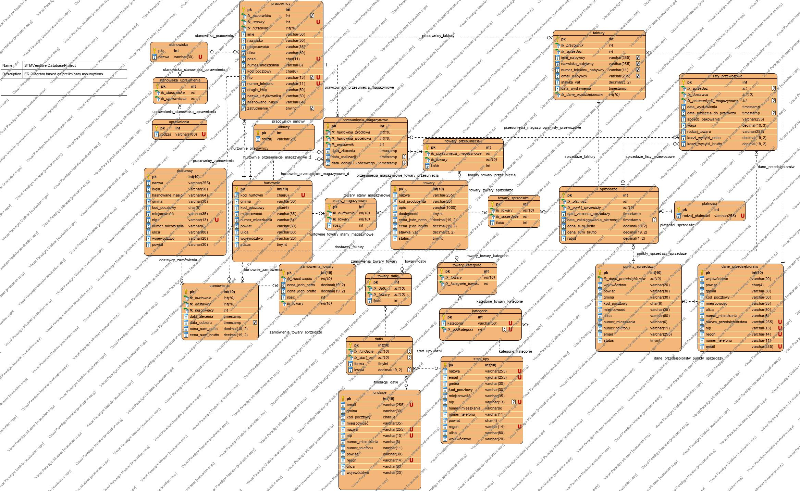

# STMVendorerDatabaseProject

## Opis organizacji pracy w firmie:

<i>
Głównym celem przedsiębiorstwa jest dystrybucja i magazynowanie sprzętu w Polsce od światowego producenta STMicroelectronics układów scalonych. Producent oferuje bogaty asortyment, który jest ściągany w dużych zamówieniach zza granicy i jest odbierany w głównej hurtowni w Polsce. Każde przyjęcie towaru musi być wraz z listem przewozowym, fakturą. Każda dostawa musi być odebrana przez uprawnionego do tego pracownika, pracownicy autoryzują swoje zadania przy użyciu karty elektronicznej, która jest wydawana przez dział informatyczny firmy. Każda z tych kart stanowi elektroniczną autoryzację pracownika i nadaje mu odpowiednie uprawnienia w zależności od jego stanowiska. Każdy pracownik ma podpisaną umowę ze spółką, która jest archiwizowana. Firma może zatrudniać różnych pracowników na różnych rodzajach umowy. Dla każdego pracownika jest przewidziana indywidualna stawka wynagrodzenia. 

Firma prowadzi jedynie sprzedaż hurtową do poddystrybutorów, których dane są archiwizowane. Sprzedaż jest udokumentowana w postaci faktury sprzedaży. Ilość produktów ulokowanych/odsprzedanych do pomniejszych punktów sprzedaży jest monitorowana. Każda sprzedaż zawiera również informację o formie płatności. Dla poszczególnej sprzedaży przewidziany jest możliwy rabat.

Zamawiany sprzęt to głównie układy scalone różnego przeznaczenia oraz elementy pasywne, są one księgowane według różnych kategorii. Towar ten jest ulokowany albo w magazynach, albo w punktach sprzedaży, bądź jest to towar, który został dopiero zamówiony i jest oczekiwany na dostarczenie. Towar może być dostarczany przez róźnych przewoźników.Firma w Polsce może mieć wiele hurtownii, oraz pomiędzy hurtowniami może być przemieszczany asortyment. Dokument przesunięcia magazynowego jest automatycznie generowany przy każdej transakcji między hurtowniami.

Firma może przekazywać datki na fundacje, której dane są również księgowane, oraz może sponsorować Start-up'y w formie sprzętu bądź pieniężnie.</i>

## 1. Wyłonienie tabel

### Podstawowe tabele:
* punkty sprzedaży/dystrybucji
* dostawcy
* hurtownia asortymentu
* płatności
* sprzedaże
* towary
* przesunięcia magazynowe
* rodzaje towarów
* umowy
* rodzaje umowy(enum)
* zamówienia
* listy przewozowe
* faktury
* fundacje
* start up'y
* stanowiska
* uprawnienia
* datki
* dane przedsiębiorstw

### Użytkowicy:
* pracownicy

### Tabele pośredniczące (powstałe w wyniku rozbicia relacji typu m:n na relacje 1:n):
* stan magazynowy
* towary_Sprzedaż
* towary_Rodzaje
* towary_Datki
* towary_Zamówienie
* przesunięcie_Towary
* uprawnienia_Stanowiska

## 2. Opisy tabel

<table>
    <tr>
        <th>Nazwa tabeli</th>
        <th>Typ</th>
        <th>Opis</th>
    </tr>
    <tr>
        <td>Kategorie towarów</td>
        <td>Podzbiór</td>
        <td>Informacje o możliwych dostępnych kategoriach towaru</td>
    </tr>    
    <tr>
        <td>Punkty sprzedaży/dystrybucji</td>
        <td>Dane</td>
        <td>Informacje o fizycznej lokalizacji konkretnego punktu sprzedaży/poddystrybutora.</td>
    </tr>
    <tr>
        <td>Dostawcy</td>
        <td>Dane</td>
        <td>Są to podstawowe dane firmy przewozowej oraz dane doradcy biznesowego od danego dostawcy</td>
    </tr>
    <tr>
        <td>Hurtownie</td>
        <td>Dane</td>
        <td>Wszystkie dane, które dotyczą lokalizacji danej hurtowani, dane kontaktowe oraz oznaczenia i kody identyfikujące jednoznacznie hurtownie oraz data rozpoczęcia operowania.</td>
    </tr>
    <tr>
        <td>Płatności</td>
        <td>Podzbiór</td>
        <td>Informacje o nazwie rodzaju płatności i dodatkowe dane niezbędne do realizacji daną metodą płatności</td>
    </tr>
    <tr>
        <td>Sprzedaże</td>
        <td>Dane</td>
        <td>Są to wszystkie informacje dotyczące poszczególnej sprzedaży hurtowej, czyli jaki towar, w jakiej ilości, z jakiej hurtowni, w jakiej cenie do jakiego punktu sprzedaży</td>
    </tr>
    <tr>
        <td>Towary</td>
        <td>Dane</td>
        <td>Wszystkie dane identyfikujące towar dostępny w dowolnej hurtowni np.: nazwa, opis, do jakiej kategorii należy, cena jednostkowa, powiązane pliki z dokumentacją</td>
    </tr>
    <tr>
        <td>Przesunięcia magazynowe</td>
        <td>Dane</td>
        <td>Są to informacje niezbędne do określenia skąd, dokąd jaki towar, w jakiej ilości, został nadany i był odebrany przez dane hurtownie</td>
    </tr>
    <tr>
        <td>Zamówienia</td>
        <td>Dane</td>
        <td>Informacja o konkretnych zamówieniach, uzupełniających stan magazynowy hurtowni</td>
    </tr>
    <tr>
        <td>Listy przewozowe</td>
        <td>Dane</td>
        <td>Ściągnięte wszystkie dane istotne do wygenerowania listu przewozowego</td>
    </tr>
    <tr>
        <td>Faktury</td>
        <td>Dane</td>
        <td>Ściągnięte wszystkie dane istotne do wygenerowania faktury</td>
    </tr>
    <tr>
        <td>Fundacje</td>
        <td>Dane</td>
        <td>Informacje fundacji, adres siedziby, dane kontaktowe, NIP, REGON KRS, STATUS OPP</td>
    </tr>
    <tr>
        <td>Start up'y</td>
        <td>Dane</td>
        <td>Informacje o organizacjach, które są sponsorowane przez firmę</td>
    </tr>
    <tr>
        <td>Stanowiska</td>
        <td>Pozbiór</td>
        <td>Informacje o wszelkich możliwych stanowiskach pracy w firmie</td>
    </tr>
    <tr>
        <td>Uprawnienia</td>
        <td>Podzbiór</td>
        <td>Spis uprawnień uznawanych przez firmę i jej regulamin, uprawnienia są ściśle związane z rodzajem stanowiska</td>
    </tr>
    <tr>
        <td>Datki</td>
        <td>Dane</td>
        <td>Informacja o tym w jakiej formie są przeznaczone datki na rzecz fundacji, bądź start up'u</td>
    </tr>
    <tr>
        <td>Dane przedsiębiorstw</td>
        <td>Dane</td>
        <td>Informacje o firmach kupujących towar z hurtowni</td>
    </tr>
    <tr>
        <td>Pracownicy</td>
        <td>Dane</td>
        <td>Informacje o pracowniku, wszelkie dane osobowe</td>
    </tr>
    <tr>
        <td>Umowy</td>
        <td>Dane</td>
        <td>Tabela przechowujące kopie każdej umowy nawiązanych miedzy firmą a pracownikami</td>
    </tr>
    <tr>
        <td>Hurtownie_Towary</td>
        <td>Łącząca</td>
        <td>Informacja o aktualnym stanie magazynowym danych(ilości) towarów oraz ich miejscu magazynowania</td>
    </tr>
    <tr>
        <td>Towary_Sprzedaż</td>
        <td>Łącząca</td>
        <td>Wskazanie jakie towary w jakiej ilości były powiązne z daną sprzedażą przy jakiej cenie jednostkowej</td>
    </tr>
    <tr>
        <td>Towary_Kategorie</td>
        <td>Łącząca</td>
        <td>Wskazanie jaki towar z hurtowni, z jaką kategorią jest powiązany</td>
    </tr>
    <tr>
        <td>Towary_Zamówienie</td>
        <td>Łącząca</td>
        <td>Informacja jakie towary, w jakiej ilości i przy jakiej cenie jednostkowej zakupu od producenta zostały zamówione</td>
    </tr>
    <tr>
        <td>Przesunięcie_Towary</td>
        <td>Łącząca</td>
        <td>Określenie jakie towary w jakiej ilości zostały zlecone do przetransportowania </td>
    </tr>
    <tr>
        <td>Uprawnienia_Stanowiska</td>
        <td>Łącząca</td>
        <td>Wskazanie powiązań, jakie uprawnienią są związane z danym stanowiskiem</td>
    </tr>
</table>

<table>
    <tr>
        <th>Nazwa typu enumerycznego</th>
        <th>Opis</th>
    </tr> 
    <tr>
        <td>Rodzaje umowy</td>
        <td>Możliwe formy umowy jakie może nawiązać firma</td>
    </tr>
</table>

## 4. Wyłonienie pól poszczególnych tabel

<table>
    <tr>
        <th>nazwa pola</th>
        <th>typ pola</th>
        <th>czy pole jest wymagane</th>
        <th>czy jest unikatowa</th>
        <th>opis</th>
    </tr>
    <tr>
        <th style="text-align: center;" colspan="5">kategorie_towarów</th>
    </tr>
    <tr>
        <td>id_kategorii_towaru</td>
        <td>całkowity</td>
        <td>tak</td>
        <td>tak</td>
        <td>identyfikator kategorii towaru</td>
    </tr>
    <tr>
        <td>kategoria</td>
        <td>znakowe(30 max)</td>
        <td>tak</td>
        <td>tak</td>
        <td>ciąg określający kategorię towaru</td>
    </tr>
    <tr>
        <td>id_podkategorii</td>
        <td>całkowite</td>
        <td>nie</td>
        <td>tak</td>
        <td>ciąg określający podkategorię towaru</td>
    </tr>
    <tr>
        <th style="text-align: center;" colspan="5">punkty_sprzedaży</th>
    </tr>
    <tr>
        <td>id_punktu_sprzedaży</td>
        <td>całkowity</td>
        <td>tak</td>
        <td>tak</td>
        <td>identyfikator punktu sprzedaży</td>
    </tr>
    <tr>
        <td>id_przedsiębiorcy</td>
        <td>całkowity</td>
        <td>nie</td>
        <td>nie</td>
        <td>identyfikator przedsiębiorcy</td>
    </tr>
    <tr>
        <td>ulica</td>
        <td>znakowe(80 max)</td>
        <td>tak</td>
        <td>nie</td>
        <td>ciąg znakowy określający nazwę ulicy</td>
    </tr>
    <tr>
        <td>numer_mieszkania</td>
        <td>znakowe(6 max)</td>
        <td>tak</td>
        <td>nie</td>
        <td>ciąg znakowy określający numer mieszkania</td>
    </tr>
    <tr>
        <td>województwo</td>
        <td>znakowe(6)</td>
        <td>tak</td>
        <td>nie</td>
        <td>ciąg znakowy określający województwo, o długości 6</td>
    </tr>
    <tr>
        <td>powiat</td>
        <td>znakowe(4)</td>
        <td>tak</td>
        <td>nie</td>
        <td>ciąg znakowy określający powiat, o długości 4</td>
    </tr>
    <tr>
        <td>gmina</td>
        <td>znakowe(6)</td>
        <td>tak</td>
        <td>nie</td>
        <td>ciąg znakowy określający gminę, o długości 2</td>
    </tr>
    <tr>
        <td>numer_telefonu</td>
        <td>znakowe(16)</td>
        <td>tak</td>
        <td>nie</td>
        <td>ciąg znakowy określający numer telefonu</td>
    </tr>
    <tr>
        <td>kod_pocztowy</td>
        <td>znakowe(6)</td>
        <td>tak</td>
        <td>nie</td>
        <td>ciąg 6 znaków określający kod pocztowy miejscowości</td>
    </tr>
    <tr>
        <td>miejscowość</td>
        <td>znakowe(35 max)</td>
        <td>tak</td>
        <td>nie</td>
        <td>ciąg znakowy określający miejscowość</td>
    </tr>
    <tr>
        <td>email</td>
        <td>znakowe(255 max)</td>
        <td>tak</td>
        <td>nie</td>
        <td>ciąg znakowy określający email</td>
    </tr>
    <tr>
        <td>status</td>
        <td>bool'owski</td>
        <td>tak</td>
        <td>nie</td>
        <td>zmienna określająca czy punkt sprzedaży dalej istnieje, tak czy nie</td>
    </tr>
    <tr>
        <th style="text-align: center;" colspan="5">dostawcy</th>
    </tr>
    <tr>
        <td>id_dostawcy</td>
        <td>całkowity</td>
        <td>tak</td>
        <td>tak</td>
        <td>identyfikator dostawcy</td>
    </tr>
    <tr>
        <td>nazwa</td>
        <td>znakowe(255 max)</td>
        <td>tak</td>
        <td>nie</td>
        <td>ciąg znakowy określający nazwę dostawcy</td>
    </tr>
    <tr>
        <td>ulica</td>
        <td>znakowe(80 max)</td>
        <td>tak</td>
        <td>nie</td>
        <td>ciąg znakowy określający nazwę ulicy</td>
    </tr>
    <tr>
        <td>numer_mieszkania</td>
        <td>znakowe(6 max)</td>
        <td>tak</td>
        <td>nie</td>
        <td>ciąg znakowy określający numer mieszkania</td>
    </tr>
    <tr>
        <td>województwo</td>
        <td>znakowe(2)</td>
        <td>tak</td>
        <td>nie</td>
        <td>ciąg znakowy określający województwo, o długości 2</td>
    </tr>
    <tr>
        <td>kod_pocztowy</td>
        <td>znakowe(6)</td>
        <td>tak</td>
        <td>nie</td>
        <td>ciąg 6 znaków określający kod pocztowy</td>
    </tr>
    <tr>
        <td>miejscowość</td>
        <td>znakowe(35 max)</td>
        <td>tak</td>
        <td>nie</td>
        <td>ciąg znakowy określający miejscowość</td>
    </tr>
    <tr>
        <td>nip</td>
        <td>całkowity(10)</td>
        <td>tak</td>
        <td>tak</td>
        <td>ciąg cyfr określający numer identyfikacyjny podatnika o długości 10</td>
    </tr>
    <tr>
        <td>miejscowość</td>
        <td>znakowe(35 max)</td>
        <td>tak</td>
        <td>nie</td>
        <td>ciąg znakowy określający miejscowość</td>
    </tr>
    <tr>
        <td>powiat</td>
        <td>znakowe(4)</td>
        <td>tak</td>
        <td>nie</td>
        <td>ciąg znakowy określający powiat, o długości 4</td>
    </tr>
    <tr>
        <td>gmina</td>
        <td>znakowe(6)</td>
        <td>tak</td>
        <td>nie</td>
        <td>ciąg znakowy określający gminę, o długości 6</td>
    </tr>
    <tr>
        <td>login</td>
        <td>znakowe(50 max)</td>
        <td>tak</td>
        <td>nie</td>
        <td>ciąg znakowy określający login</td>
    </tr>
    <tr>
        <td>haszowane_hasło</td>
        <td>znakowe(64)</td>
        <td>tak</td>
        <td>nie</td>
        <td>ciąg znakowy określający haszowane hasło, o długości 64</td>
    </tr>
     <tr>
        <th style="text-align: center;" colspan="5">hurtownie</th>
    </tr>
    <tr>
        <td>id_hurtowni</td>
        <td>całkowite</td>
        <td>tak</td>
        <td>tak</td>
        <td>identyfikator hurtownii</td>
    </tr>
    <tr>
        <td>kod_hurtowni</td>
        <td>znakowe(6 max)</td>
        <td>tak</td>
        <td>tak</td>
        <td>ciąg znakowy określający hurtownię</td>
    </tr>
    <tr>
        <td>ulica</td>
        <td>znakowe(80 max)</td>
        <td>tak</td>
        <td>nie</td>
        <td>ciąg znakowy określający nazwę ulicy</td>
    </tr>
    <tr>
        <td>numer_mieszkania</td>
        <td>znakowe(6 max)</td>
        <td>tak</td>
        <td>nie</td>
        <td>ciąg znakowy określający numer mieszkania</td>
    </tr>
    <tr>
        <td>województwo</td>
        <td>znakowe(2</td>
        <td>tak</td>
        <td>nie</td>
        <td>ciąg znakowy określający województwo, o długości 2</td>
    </tr>
    <tr>
        <td>kod_pocztowy</td>
        <td>znakowe(6)</td>
        <td>tak</td>
        <td>nie</td>
        <td>ciąg znakowy określający kod pocztowy</td>
    </tr>
    <tr>
        <td>miejscowość</td>
        <td>znakowe(35 max)</td>
        <td>tak</td>
        <td>nie</td>
        <td>ciąg znakowy określający miejscowość</td>
    </tr>
    <tr>
        <td>powiat</td>
        <td>znakowe(4)</td>
        <td>tak</td>
        <td>nie</td>
        <td>ciąg znakowy określający powiat, o długości 4</td>
    </tr>
    <tr>
        <td>gmina</td>
        <td>znakowe(6)</td>
        <td>tak</td>
        <td>nie</td>
        <td>ciąg znakowy określający gminę, o długości 6</td>
    </tr>
    <tr>
        <td>status</td>
        <td>bool'owski</td>
        <td>tak</td>
        <td>nie</td>
        <td>zmienna określająca czy hurtownia dalej istnieje</td>
    </tr>
     <tr>
        <th style="text-align: center;" colspan="5">płatności</th>
    </tr>
    <tr>
        <td>id_płatności</td>
        <td>całkowite</td>
        <td>tak</td>
        <td>tak</td>
        <td>identyfikator płatności</td>
    </tr>
    <tr>
        <td>rodzaj_płatności</td>
        <td>znakowe(255 max)</td>
        <td>tak</td>
        <td>tak</td>
        <td>ciąg znakowy określający rodzaj płatności</td>
    </tr>
    <tr>
        <td>dostępność</td>
        <td>bool'owski</td>
        <td>tak</td>
        <td>nie</td>
        <td>zmienna określająca czy dany rodzaj płatności jest dalej możliwy</td>
    </tr>
     <tr>
        <th style="text-align: center;" colspan="5">sprzedaże</th>
    </tr>
    <tr>
        <td>id_sprzedaży</td>
        <td>całkowity</td>
        <td>tak</td>
        <td>tak</td>
        <td>identyfikator sprzedaży</td>
    </tr>
    <tr>
        <td>id_płatności</td>
        <td>całkowity</td>
        <td>tak</td>
        <td>nie</td>
        <td>identyfikator płatności</td>
    </tr>
    <tr>
        <td>id_punktu_sprzedaży</td>
        <td>całkowity</td>
        <td>tak</td>
        <td>nie</td>
        <td>identyfikator punktu sprzedaży</td>
    </tr>
    <tr>
        <td>data_zlecenia_sprzedaży</td>
        <td>timestamp</td>
        <td>tak</td>
        <td>nie</td>
        <td>data wystawienia zlecenia sprzedaży</td>
    </tr>
    <tr>
        <td>data_zaksięgowania_płatności</td>
        <td>timestamp</td>
        <td>tak</td>
        <td>nie</td>
        <td>data zaksięgowowania płatności</td>
    </tr>
    <tr>
        <td>rabat</td>
        <td>decymalny</td>
        <td>tak</td>
        <td>nie</td>
        <td>liczba zmiennoprzecinkowa określająca wielkość rabatu</td>
    </tr>
    <tr>
        <td>cena_sum_netto</td>
        <td>decymalny</td>
        <td>tak</td>
        <td>nie</td>
        <td>liczba zmiennoprzecinkowa określająca cenę sumaryczną netto</td>
    </tr>
    <tr>
        <td>cena_sum_brutto</td>
        <td>całkowity</td>
        <td>tak</td>
        <td>nie</td>
        <td>liczba zmiennoprzecinkowa określająca cenę sumaryczną brutto</td>
    </tr>
    <tr>
        <th style="text-align: center;" colspan="5">towary</th>
    </tr>
    <tr>
        <td>id_towaru</td>
        <td>całkowity</td>
        <td>tak</td>
        <td>tak</td>
        <td>identyfikator towaru</td>
    </tr>
    <tr>
        <td>nazwa</td>
        <td>znakowy(255 max)</td>
        <td>tak</td>
        <td>nie</td>
        <td>ciąg znakowy określający nazwę towaru</td>
    </tr>
    <tr>
        <td>kod_producenta</td>
        <td>znakowe(10 max)</td>
        <td>tak</td>
        <td>tak</td>
        <td>ciąg znakowy określający kod producenta</td>
    </tr>
    <tr>
        <td>opis</td>
        <td>znakowe(1000 max)</td>
        <td>tak</td>
        <td>nie</td>
        <td>ciąg znakowy określający cechy, opinie o towarze</td>
    </tr>
    <tr>
        <td>dostępność</td>
        <td>boolowski</td>
        <td>tak</td>
        <td>nie</td>
        <td>wskazuje na dostępność towaru, tak bądź nie</td>
    </tr>
    <tr>
        <td>cena_jedn_netto</td>
        <td>decymalny</td>
        <td>tak</td>
        <td>nie</td>
        <td>liczba zmiennoprzecinkowa określająca wartość ceny pojedyńczego produktu netto</td>
    </tr>
    <tr>
        <td>cena_jedn_brutto</td>
        <td>decymalny</td>
        <td>tak</td>
        <td>nie</td>
        <td>liczba zmiennoprzecinkowa określająca wartość ceny pojedyńczego produktu brutto</td>
    </tr>
    <tr>
        <td>stawka_vat</td>
        <td>decymalny</td>
        <td>tak</td>
        <td>nie</td>
        <td>liczba zmiennoprzecinkowa określająca wielkość stawki vat'u</td>
    </tr>
    <tr>
        <td>status</td>
        <td>bool'owski</td>
        <td>tak</td>
        <td>nie</td>
        <td>zmienna określająca czy towar jest dalej sprzedowany, tak czy nie</td>
    </tr>
    <tr>
        <th style="text-align: center;" colspan="5">przesunięcia_magazynowe</th>
    </tr>
    <tr>
        <td>id_przesunięcia_magazynowego</td>
        <td>całkowity</td>
        <td>tak</td>
        <td>tak</td>
        <td>identyfikator przesunięcia magazynowego</td>
    </tr>
    <tr>
        <td>id_pracownik</td>
        <td>całkowity</td>
        <td>tak</td>
        <td>nie</td>
        <td>identyfikator pracownika</td>
    </tr>
    <tr>
        <td>data_zlecenia</td>
        <td>timestamp</td>
        <td>tak</td>
        <td>nie</td>
        <td>data wystawiwenia zlecenia</td>
    </tr>
    <tr>
        <td>data_realizacji</td>
        <td>timestamp</td>
        <td>tak</td>
        <td>nie</td>
        <td>data realizacji zlecenia</td>
    </tr>
    <tr>
        <td>data_odbioru_końcowego</td>
        <td>timestamp</td>
        <td>tak</td>
        <td>nie</td>
        <td>data odbioru przesunięcia towarowego</td>
    </tr>
    <tr>
        <td>id_hurtownia_źródłowa</td>
        <td>całkowity</td>
        <td>tak</td>
        <td>nie</td>
        <td>identyfikator hurtowni, z której przesuwamy towar</td>
    </tr>
    <tr>
        <td>id_hurtownia_docelowa</td>
        <td>całkowity</td>
        <td>tak</td>
        <td>nie</td>
        <td>identyfikator hurtowni, do której przesuwamy towar</td>
    </tr>
    <tr>
        <th style="text-align: center;" colspan="5">zamówienia</th>
    </tr>
    <tr>
        <td>id_zamówienia</td>
        <td>całkowity</td>
        <td>tak</td>
        <td>tak</td>
        <td>identyfiaktor zamówienia</td>
    </tr>
    <tr>
        <td>id_dostawcy</td>
        <td>całkowity</td>
        <td>tak</td>
        <td>nie</td>
        <td>identyfikator dostawcy</td>
    </tr>
    <tr>
        <td>id_hurtownie</td>
        <td>całkowity</td>
        <td>tak</td>
        <td>nie</td>
        <td>identyfikator hurtowni</td>
    </tr>
    <tr>
        <td>id_pracownicy</td>
        <td>całkowity</td>
        <td>tak</td>
        <td>nie</td>
        <td>identyfikator pracownika</td>
    </tr>
    <tr>
        <td>data_zlecenia</td>
        <td>timestamp</td>
        <td>tak</td>
        <td>nie</td>
        <td>data wystawienia zlecenia</td>
    </tr>
    <tr>
        <td>data_odbioru</td>
        <td>timestamp</td>
        <td>tak</td>
        <td>nie</td>
        <td>data odbioru zamówienia</td>
    </tr>
    <tr>
        <td>cena_jedn_netto</td>
        <td>decymalny</td>
        <td>tak</td>
        <td>nie</td>
        <td>liczba zmiennoprzecinkowa określająca wartość ceny pojedyńczego produktu netto</td>
    </tr>
    <tr>
        <td>cena_jedn_brutto</td>
        <td>decymalny</td>
        <td>tak</td>
        <td>nie</td>
        <td>liczba zmiennoprzecinkowa określająca wartość ceny pojedyńczego produktu brutto</td>
    </tr>
    <tr>
        <th style="text-align: center;" colspan="5">listy_przewozowe</th>
    </tr>
    <tr>
        <td>id_listu_przewozowego</td>
        <td>całkowity</td>
        <td>tak</td>
        <td>tak</td>
        <td>identyfikator listu przewozowego</td>
    </tr>
    <tr>
        <td>id_sprzedaż</td>
        <td>całkowity</td>
        <td>tak</td>
        <td>tak</td>
        <td>identyfikator sprzedaży</td>
    </tr>
    <tr>
        <td>id_dostawca</td>
        <td>całkowity</td>
        <td>tak</td>
        <td>nie</td>
        <td>identyfikator dostawcy</td>
    </tr>
    <tr>
        <td>id_przesunięcie_magazynowe</td>
        <td>całkowity</td>
        <td>tak</td>
        <td>tak</td>
        <td>identyfiaktor przesunięcia magazynowego</td>
    </tr>
    <tr>
        <td>data_wystawienia</td>
        <td>timestamp</td>
        <td>tak</td>
        <td>nie</td>
        <td>data wystawienia listu przewozowego</td>
    </tr>
    <tr>
        <td>data_przyjęcia_do_przewozu</td>
        <td>timestamp</td>
        <td>nie</td>
        <td>nie</td>
        <td>data przyjęcia towaru do przewozu</td>
    </tr>
    <tr>
        <td>sposób pakowania</td>
        <td>enumeryczny</td>
        <td>tak</td>
        <td>nie</td>
        <td>ciąg znakowy określający sposób zapokowania towaru</td>
    </tr>
    <tr>
        <td>waga</td>
        <td>decymalny</td>
        <td>tak</td>
        <td>nie</td>
        <td>liczba zmiennoprzecinkowa określająca wagę towaru</td>
    </tr>
    <tr>
        <td>rodzaj_towaru</td>
        <td>znakowe(255 max)</td>
        <td>tak</td>
        <td>nie</td>
        <td>ciąg znakowy określający rodzaj towaru</td>
    </tr>
    <tr>
        <td>koszt_wysyłki_netto</td>
        <td>decymalny</td>
        <td>tak</td>
        <td>nie</td>
        <td>liczba zmiennoprzecinkowa określająca koszt wysyłki netto</td>
    </tr>
    <tr>
        <td>koszt_wysyłki_brutto</td>
        <td>decymalny</td>
        <td>tak</td>
        <td>nie</td>
        <td>liczba zmiennoprzecinkowa określająca koszt wysyłki brutto</td>
    </tr>
    <tr>
        <th style="text-align: center;" colspan="5">faktury</th>
    </tr>
    <tr>
        <td>id_faktury</td>
        <td>całkowity</td>
        <td>tak</td>
        <td>tak</td>
        <td>identyfikator faktury</td>
    </tr>
    <tr>
        <td>id_pracownik</td>
        <td>całkowity</td>
        <td>tak</td>
        <td>tak</td>
        <td>identyfikator pracownika</td>
    </tr>
    <tr>
        <td>id_sprzedaż</td>
        <td>całkowity</td>
        <td>tak</td>
        <td>tak</td>
        <td>identyfikator sprzedaży</td>
    </tr>
    <tr>
        <td>id_dane_przedsiębiorstw</td>
        <td>całkowity</td>
        <td>tak</td>
        <td>tak</td>
        <td>identyfikator danego przedsiębiorstwa</td>
    </tr>
    <tr>
        <td>imię_nabywcy</td>
        <td>znakowy(255 max)</td>
        <td>nie</td>
        <td>nie</td>
        <td>ciąg znakowy określający imię nabywcy</td>
    </tr>
    <tr>
        <td>nazwisko_nabywcy</td>
        <td>znakowy(255 max)</td>
        <td>nie</td>
        <td>nie</td>_
        <td>ciąg znakowy określający nazwisko nabywcy</td>
    </tr>
    <tr>
        <td>numer_telefonu_nabywcy</td>
        <td>znakowy(16)</td>
        <td>nie</td>
        <td>nie</td>
        <td>ciąg znaków określający numer telefonu nabywcy</td>
    </tr>
    <tr>
        <td>email_nabywcy</td>
        <td>znakowe(255 max)</td>
        <td>nie</td>
        <td>nie</td>
        <td>ciąg znakowy określający email nabywcy</td>
    </tr>
    <tr>
        <td>id_pracownik</td>
        <td>całkowity</td>
        <td>tak</td>
        <td>nie</td>
        <td>identyfiaktor pracownika</td>
    </tr>
    <tr>
        <td>id_sprzedaż</td>
        <td>całkowity</td>
        <td>tak</td>
        <td>tak</td>
        <td>identyfikator sprzedaży</td>
    </tr>
    <tr>
        <td>stawka_vat</td>
        <td>decymalny</td>
        <td>tak</td>
        <td>nie</td>
        <td>liczba zmiennoprzecinkowa określająca wielkość stawki vat'u</td>
    </tr>
    <tr>
        <td>data_wystawienia</td>
        <td>timestamp</td>
        <td>tak</td>
        <td>nie</td>
        <td>data wystawienia faktury</td>
    </tr>
    <tr>
        <th style="text-align: center;" colspan="5">fundacje</th>
    </tr>
    <tr>
        <td>id_fundacji</td>
        <td>całkowity</td>
        <td>tak</td>
        <td>tak</td>
        <td>identyfikator fundacji</td>
    </tr>
     <tr>
        <td>ulica</td>
        <td>znakowe(80 max)</td>
        <td>tak</td>
        <td>nie</td>
        <td>ciąg znakowy określający nazwę ulicy, na której znajduje się fundacja</td>
    </tr>
    <tr>
        <td>numer_mieszkania</td>
        <td>znakowe(6 max)</td>
        <td>tak</td>
        <td>nie</td>
        <td>ciąg znakowy określający numer mieszknia fundacji</td>
    </tr>
    <tr>
        <td>województwo</td>
        <td>znakowe(2)</td>
        <td>tak</td>
        <td>nie</td>
        <td>ciąg znakowy określający województwo, w którym znajduje się fundacja, o długości 2</td>
    </tr>
    <tr>
        <td>powiat</td>
        <td>znakowe(4)</td>
        <td>tak</td>
        <td>nie</td>
        <td>ciąg znakowy określający powiat, na którym znajduje się fundacja, o długości 4</td>
    </tr>
    <tr>
        <td>gmina</td>
        <td>znakowe(6)</td>
        <td>tak</td>
        <td>nie</td>
        <td>ciąg znakowy określający gminę, na którym znajduje się fundacja, o długości 6</td>
    </tr>
    <tr>
        <td>kod_pocztowy</td>
        <td>znakowe(6)</td>
        <td>tak</td>
        <td>nie</td>
        <td>ciąg 6 znaków określający kod pocztowy miejscowości, w której znajduje się fundacja</td>
    </tr>
    <tr>
        <td>miejscowość</td>
        <td>znakowe(35 max)</td>
        <td>tak</td>
        <td>nie</td>
        <td>ciąg znakowy określający miejscowość, na której znajduje się fundacja</td>
    </tr>
    <tr>
        <td>nazwa</td>
        <td>znakowy(255 max)</td>
        <td>tak</td>
        <td>tak</td>
        <td>ciąg znakowy określający nazwę fundacji</td>
    </tr>
    <tr>
        <td>numer_telefonu</td>
        <td>znakowy(16)</td>
        <td>tak</td>
        <td>nie</td>
        <td>ciąg znaków określający numer telefon fundacji</td>
    </tr>
    <tr>
        <td>email</td>
        <td>znakowy(255 max)</td>
        <td>tak</td>
        <td>tak</td>
        <td>ciąg znakowy określający email fundacji</td>
    </tr>
    <tr>
        <td>nip</td>
        <td>całkowity(10)</td>
        <td>tak</td>
        <td>tak</td>
        <td>ciag cyfr określający numer identyfikacyjny podatnika o długości 10, fundacji </td>
    </tr>
    <tr>
        <td>regon</td>
        <td>całkowity(14 lub 9)</td>
        <td>tak</td>
        <td>tak</td>
        <td>ciąg cyfr określający numer regon fundacji, o długości 9 bądź 14</td>
    </tr>
    <tr>
        <th style="text-align: center;" colspan="5">start_up</th>
    </tr>
    <tr>
        <td>id_start_up</td>
        <td>całkowity</td>
        <td>tak</td>
        <td>tak</td>
        <td>identyfikator start up'u</td>
    </tr>
     <tr>
        <td>ulica</td>
        <td>znakowe(80 max)</td>
        <td>tak</td>
        <td>nie</td>
        <td>ciąg znakowy określający nazwę ulicy, na ktorej znajduje się start up</td>
    </tr>
    <tr>
        <td>numer_mieszkania</td>
        <td>znakowe(6 max)</td>
        <td>tak</td>
        <td>nie</td>
        <td>ciąg znakowy określający numer mieszkania start up'u</td>
    </tr>
    <tr>
        <td>kod_pocztowy</td>
        <td>znakowe(6)</td>
        <td>tak</td>
        <td>nie</td>
        <td>ciąg znakowy określający kod pocztowy miejscowości, w której znajduje się start up</td>
    </tr>
    <tr>
        <td>miejscowość</td>
        <td>znakowe(35 max)</td>
        <td>tak</td>
        <td>nie</td>
        <td>ciąg znakowy określający miejscowość, w której znajduje się start up</td>
    </tr>
   <tr>
        <td>województwo</td>
        <td>znakowe(2)</td>
        <td>tak</td>
        <td>nie</td>
        <td>ciąg znakowy określający województwo, w którym znajduje się start up, o długości 2</td>
    </tr>
    <tr>
        <td>powiat</td>
        <td>znakowe(4)</td>
        <td>tak</td>
        <td>nie</td>
        <td>ciąg znakowy określający powiat, na którym znajduje się start up, o długości 4</td>
    </tr>
    <tr>
        <td>gmina</td>
        <td>znakowe(6)</td>
        <td>tak</td>
        <td>nie</td>
        <td>ciąg znakowy określający gminę, na którym znajduje się start up, o długości 6</td>
    </tr>
    <tr>
        <td>nazwa</td>
        <td>znakowy(255 max)</td>
        <td>tak</td>
        <td>nie</td>
        <td>ciąg znakowy określający nazwę start up'u</td>
    </tr>
    <tr>
        <td>nip</td>
        <td>znakowy(10)</td>
        <td>nie</td>
        <td>tak</td>
        <td>ciag znaków określający numer identyfikacyjny podatnika o długości 10, start up'u</td>
    </tr>
    <tr>
        <td>regon</td>
        <td>znakowy(14 bądź 9 )</td>
        <td>tak</td>
        <td>tak</td>
        <td>ciag znaków określający numer regon o długości 14 bądź 9, start up'u</td>
    </tr>
    <tr>
        <td>numer_telefonu</td>
        <td>znakowy(16)</td>
        <td>tak</td>
        <td>tak</td>
        <td>ciag znaków określający numer telefonu, start up'u</td>
    </tr>
    <tr>
        <th style="text-align: center;" colspan="5">stanowiska</th>
    </tr>
    <tr>
        <td>id_stanowiska</td>
        <td>całkowity</td>
        <td>tak</td>
        <td>tak</td>
        <td>identyfikator stanowiska</td>
    </tr>
    <tr>
        <td>nazwa</td>
        <td>znakowy(20 max)</td>
        <td>tak</td>
        <td>tak</td>
        <td>ciąg znaków określający nazwę stanowiska</td>
    </tr>
    <tr>
        <th style="text-align: center;" colspan="5">uprawnienia</th>
    </tr>
    <tr>
        <td>id_uprawnienia</td>
        <td>całkowity</td>
        <td>tak</td>
        <td>tak</td>
        <td>identyfikator uprawnienia</td>
    </tr>
    <tr>
        <td>rodzaj</td>
        <td>znakowy(100 maks)</td>
        <td>tak</td>
        <td>tak</td>
        <td>ciąg znaków określający rodzaj</td>
    </tr>
    <tr>
        <th style="text-align: center;" colspan="5">datki</th>
    </tr>
    <tr>
        <td>id_datku</td>
        <td>całkowity</td>
        <td>tak</td>
        <td>tak</td>
        <td>identyfikator datku</td>
    </tr>
    <tr>
        <td>forma</td>
        <td>bool'owski</td>
        <td>tak</td>
        <td>nie</td>
        <td>rozróżnia czy mamy doczynienia z fundacją bądź start up'em</td>
    </tr>
    <tr>
        <td>kwota</td>
        <td>decymalny</td>
        <td>tak</td>
        <td>nie</td>
        <td>liczba zmiennoprzecinkowa określająca kwotę przeznaczoną na fundację/start up</td>
    </tr>
    <tr>
        <th style="text-align: center;" colspan="5">dane_przedsiębiorstw</th>
    </tr>
    <tr>
        <td>id_przedsiębiorstwa</td>
        <td>całkowity</td>
        <td>tak</td>
        <td>tak</td>
        <td>identyfikator przedsiębiorstwa</td>
    </tr>
    <tr>
        <td>ulica</td>
        <td>znakowe(80 max)</td>
        <td>tak</td>
        <td>nie</td>
        <td>ciąg znakowy określający nazwę ulicy, na ktorej znajduje się przedsiębiorstwo</td>
    </tr>
    <tr>
        <td>numer_mieszkania</td>
        <td>znakowe(6 max)</td>
        <td>tak</td>
        <td>nie</td>
        <td>ciąg znakowy określający numer mieszkania przedsiębiorstwa/td>
    </tr>
    <tr>
        <td>województwo</td>
        <td>znakowe(2)</td>
        <td>tak</td>
        <td>nie</td>
        <td>ciąg znakowy określający województwo, w którym znajduje się przedsiębiorstwo, o długości 2</td>
    </tr>
    <tr>
        <td>powiat</td>
        <td>znakowe(4)</td>
        <td>tak</td>
        <td>nie</td>
        <td>ciąg znakowy określający powiat, na którym znajduje się przedsiębiorstwo, o długości 4</td>
    </tr>
    <tr>
        <td>gmina</td>
        <td>znakowe(6)</td>
        <td>tak</td>
        <td>nie</td>
        <td>ciąg znakowy określający gminę, na którym znajduje się przedsiębiorstwo, o długości 6</td>
    </tr>
    <tr>
        <td>email</td>
        <td>znakowe(80)</td>
        <td>tak</td>
        <td>tak</td>
        <td>ciąg znakowy określający email przedsiębiorstwa</td>
    </tr>
    <tr>
        <td>kod_pocztowy</td>
        <td>znakowe(6)</td>
        <td>tak</td>
        <td>nie</td>
        <td>ciąg znakowy określający kod pocztowy miejscowości miejscowości, w której znajduje się przedsiębiorstwo</td>
    </tr>
    <tr>
        <td>miejscowość</td>
        <td>znakowe(35 max)</td>
        <td>tak</td>
        <td>nie</td>
        <td>ciąg znakowy określający miejscowość, w której znajduje się przedsiębiorstwo</td>
    </tr>
    <tr>
        <td>nazwa_przedsiębiorstwa</td>
        <td>znakowy(255 max)</td>
        <td>tak</td>
        <td>tak</td>
        <td>ciąg znakowy określający nazwę przedsiębiorstwa</td>
    </tr>
    <tr>
        <td>nip</td>
        <td>znakowy(10)</td>
        <td>tak</td>
        <td>tak</td>
        <td>ciag znaków określający numer identyfikacyjny podatnika o długości 10, przedsiębiorstwa</td>
    </tr>
    <tr>
        <td>regon</td>
        <td>znakowy(14 max)</td>
        <td>tak</td>
        <td>tak</td>
        <td>ciag cyfr określający numer regon długości 14 bądź 9, przedsiębiorstwa</td>
    </tr>
    <tr>
        <td>numer_telefonu</td>
        <td>znakowy(16)</td>
        <td>tak</td>
        <td>tak</td>
        <td>ciag cyfr określający numer telefonu, przedsiębiorstwa</td>
    </tr>
    <tr>
        <th style="text-align: center;" colspan="5">pracownicy</th>
    </tr>
    <tr>
        <td>id_pracownika</td>
        <td>calkowity</td>
        <td>tak</td>
        <td>tak</td>
        <td>identyfikator pracownika</td>
    </tr>
    <tr>
        <td>id_umowy</td>
        <td>całkowity</td>
        <td>tak</td>
        <td>tak</td>
        <td>identyfikator umowy</td>
    </tr>
    <tr>
        <td>id_stanowiska</td>
        <td>całkowity</td>
        <td>nie</td>
        <td>nie</td>
        <td>identyfikator stanowiska</td>
    </tr>
    <tr>
        <td>id_hurtownie</td>
        <td>całkowity</td>
        <td>tak</td>
        <td>nie</td>
        <td>identyfikator hurtowni</td>
    </tr>
    <tr>
        <td>imię</td>
        <td>znakowy(50 max)</td>
        <td>tak</td>
        <td>nie</td>
        <td>ciąg znaków określający imię pracownika</td>
    </tr>
    <tr>
        <td>drugie_imię</td>
        <td>znakowy(50 max)</td>
        <td>tak</td>
        <td>nie</td>
        <td>ciąg znaków określający drugie imię pracownika</td>
    </tr>
    <tr>
        <td>nazwisko</td>
        <td>znakowy(50 max)</td>
        <td>tak</td>
        <td>nie</td>
        <td>ciąg znaków określający nazwisko pracownika</td>
    </tr>
    <tr>
        <td>pesel</td>
        <td>znakowy(11)</td>
        <td>tak</td>
        <td>tak</td>
        <td>ciąg znaków określający pesel pracownika, o długości 11</td>
    </tr>
    <tr>
        <td>ulica</td>
        <td>znakowe(80 max)</td>
        <td>tak</td>
        <td>nie</td>
        <td>ciąg znaków określający ulicę, na której mieszka pracownik</td>
    </tr>
    <tr>
        <td>numer_mieszkania</td>
        <td>znakowe(6 max)</td>
        <td>tak</td>
        <td>nie</td>
        <td>ciąg znaków określający numer mieszkania, w którym mieszka pracownik</td>
    </tr>
    <tr>
        <td>kod_pocztowy</td>
        <td>znakowe(6 max)</td>
        <td>tak</td>
        <td>nie</td>
        <td>ciąg znaków określający kod pocztowy miejscowości, w której mieszka pracownik</td>
    </tr>
    <tr>
        <td>miejscowość</td>
        <td>znakowe(30 max)</td>
        <td>tak</td>
        <td>nie</td>
        <td>ciąg znaków określający miejsowość, w której mieszka pracownik</td>
    </tr>
    <tr>
        <td>województwo</td>
        <td>znakowe(2)</td>
        <td>tak</td>
        <td>nie</td>
        <td>ciąg znakowy określający województwo, w którym mieszka pracownik, o długości 2</td>
    </tr>
    <tr>
        <td>powiat</td>
        <td>znakowe(4)</td>
        <td>tak</td>
        <td>nie</td>
        <td>ciąg znakowy określający powiat, w którym mieszka pracownik, o długości 4</td>
    </tr>
    <tr>
        <td>gmina</td>
        <td>znakowe(6)</td>
        <td>tak</td>
        <td>nie</td>
        <td>ciąg znakowy określający gminę, w którym mieszka pracownik, o długości 6</td>
    </tr>
    <tr>
        <td>numer_telefonu</td>
        <td>znakowy(16)</td>
        <td>tak</td>
        <td>tak</td>
        <td>ciąg znaków określający numer telefonu pracownika</td>
    </tr>
    <tr>
        <td>nip</td>
        <td>znakowy(10)</td>
        <td>nie</td>
        <td>tak</td>
        <td>ciąg znaków określający numer nip pracownika</td>
    </tr>
    <tr>
        <td>nazwa_użytkownika</td>
        <td>znakowy(50)</td>
        <td>tak</td>
        <td>nie</td>
        <td>ciąg znaków określający nazwę użytkownika konta pracownika</td>
    </tr>
    <tr>
        <td>hashowane_hasło</td>
        <td>znakowy(64)</td>
        <td>tak</td>
        <td>nie</td>
        <td>ciąg znaków określający hasz hasła pracownika</td>
    </tr>
    <tr>
        <th style="text-align: center;" colspan="5">umowy</th>
    </tr>
    <tr>
        <td>id_umowy</td>
        <td>całkowity</td>
        <td>tak</td>
        <td>tak</td>
        <td>identyfikator umowy</td>
    </tr>
    <tr>
        <td>rodzaj</td>
        <td>znakowy(20 max)</td>
        <td>tak</td>
        <td>tak</td>
        <td>ciąg znaków określający rodzaj umowy</td>
    </tr>
    <tr>
        <td>dokument</td>
        <td>bitowy(20 max)</td>
        <td>tak</td>
        <td>tak</td>
        <td>ciąg bitów odnoszący się do dokumentu</td>
    </tr>
    <tr>
        <th style="text-align: center;" colspan="5">stany_magazynowe</th>
    </tr>
    <tr>
        <td>id_stanu_magazynowego</td>
        <td>całkowity</td>
        <td>tak</td>
        <td>tak</td>
        <td>identyfikator stanu magazynowego</td>
    </tr>
    <tr>
        <td>id_hurtownie</td>
        <td>całkowity</td>
        <td>tak</td>
        <td>nie</td>
        <td>identyfikator hurtowni</td>
    </tr>
    <tr>
        <td>id_towary</td>
        <td>całkowity</td>
        <td>tak</td>
        <td>nie</td>
        <td>identyfikator towaru</td>
    </tr>
    <tr>
        <td>ilość</td>
        <td>całkowity</td>
        <td>tak</td>
        <td>nie</td>
        <td>liczba całkowita określająca ilość towaru</td>
    </tr>
    <tr>
        <th style="text-align: center;" colspan="5">towary_sprzedaże</th>
    </tr>
    <tr>
        <td>id_towary_sprzedaże</td>
        <td>całkowity</td>
        <td>tak</td>
        <td>tak</td>
        <td>identyfikator tabeli towary-sprzedaże</td>
    </tr>
    <tr>
        <td>id_towary</td>
        <td>całkowity</td>
        <td>tak</td>
        <td>nie</td>
        <td>identyfikator towaru</td>
    </tr>
    <tr>
        <td>id_sprzedaże</td>
        <td>całkowity</td>
        <td>tak</td>
        <td>nie</td>
        <td>identyfikator sprzedaży</td>
    </tr>
    <tr>
        <td>ilość</td>
        <td>całkowity</td>
        <td>tak</td>
        <td>nie</td>
        <td>liczba opisująca liczebność danego towaru</td>
    </tr>
    <tr>
        <th style="text-align: center;" colspan="5">towary_kategorie_towarów</th>
    </tr>
    <tr>
        <td>id_towary_kategorie_towarów</td>
        <td>całkowity</td>
        <td>tak</td>
        <td>tak</td>
        <td>identyfikator tabeli towary-kategorie towarów</td>
    </tr>
    <tr>
        <td>id_towary</td>
        <td>całkowity</td>
        <td>tak</td>
        <td>nie</td>
        <td>identyfikator towaru</td>
    </tr>
    <tr>
        <td>id_kategorie_towaru</td>
        <td>całkowity</td>
        <td>tak</td>
        <td>nie</td>
        <td>identyfikator kategorii</td>
    </tr>
    <tr>
        <th style="text-align: center;" colspan="5">zamówienia_towary</th>
    </tr>
    <tr>
        <td>id_towary_sprzedaże</td>
        <td>całkowity</td>
        <td>tak</td>
        <td>tak</td>
        <td>identyfikator zamówienia</td>
    </tr>
    <tr>
        <td>id_sprzedaże</td>
        <td>całkowity</td>
        <td>tak</td>
        <td>nie</td>
        <td>identyfikator sprzedaży</td>
    </tr>
    <tr>
        <td>id_zamówienia</td>
        <td>całkowity</td>
        <td>tak</td>
        <td>nie</td>
        <td>identyfikator zamówienia</td>
    </tr>
    <tr>
        <td>cena_jednostkowa_netto</td>
        <td>decymalny</td>
        <td>tak</td>
        <td>nie</td>
        <td>liczba zmiennoprzecinkowa określająca cenę jednostkową towaru netto</td>
    </tr>
    <tr>
        <td>cena_jednostkowa_brutto</td>
        <td>decymalny</td>
        <td>tak</td>
        <td>nie</td>
        <td>liczba zmiennoprzecinkowa określająca cenę jednostkową towaru brutto</td>
    </tr>
    <tr>
        <td>ilość</td>
        <td>całkowity</td>
        <td>tak</td>
        <td>nie</td>
        <td>liczba całkowita określająca ilość towaru</td>
    </tr>
     <tr>
        <th style="text-align: center;" colspan="5">przesunięcia_towary</th>
    </tr>
    <tr>
        <td>id_przesunięcia_towary</td>
        <td>całkowity</td>
        <td>tak</td>
        <td>tak</td>
        <td>identyfikator tabeli przesunięcia-towary</td>
    </tr>
     <tr>
        <td>id_przesunięcia_magazynowe</td>
        <td>całkowity</td>
        <td>tak</td>
        <td>nie</td>
        <td>identyfikator przesunięcia magazynowego</td>
    </tr>
    <tr>
        <td>id_towary</td>
        <td>całkowity</td>
        <td>tak</td>
        <td>nie</td>
        <td>identyfikator towaru</td>
    </tr>
     <tr>
        <td>ilość</td>
        <td>całkowity</td>
        <td>tak</td>
        <td>nie</td>
        <td>liczba całkowita określająca ilość towaru</td>
    </tr>
    <tr>
        <th style="text-align: center;" colspan="5">uprawnienia_stanowiska</th>
    </tr>
    <tr>
        <td>id_uprawnienia_stanowiska</td>
        <td>całkowity</td>
        <td>tak</td>
        <td>tak</td>
        <td>identyfikator tabeli uprawnienia-stanowiska</td>
    </tr>
     <tr>
        <td>id_uprawnienia</td>
        <td>całkowity</td>
        <td>tak</td>
        <td>nie</td>
        <td>identyfikator uprawnień</td>
    </tr>
    <tr>
        <td>id_stanowiska</td>
        <td>całkowity</td>
        <td>tak</td>
        <td>nie</td>
        <td>identyfikator stanowiska</td>
    </tr>
    <tr>
        <th style="text-align: center;" colspan="5">towary_datki</th>
    </tr>
    <tr>
        <td>id_towary_datki</td>
        <td>całkowity</td>
        <td>tak</td>
        <td>tak</td>
        <td>identyfikator tabeli towary-datki</td>
    </tr>
    <tr>
        <td>id_towary</td>
        <td>całkowity</td>
        <td>tak</td>
        <td>nie</td>
        <td>identyfikator towaru</td>
    </tr>
    <tr>
        <td>id_datki</td>
        <td>całkowity</td>
        <td>tak</td>
        <td>nie</td>
        <td>identyfikator datku</td>
    </tr>
    <tr>
        <td>ilość</td>
        <td>całkowity</td>
        <td>tak</td>
        <td>nie</td>
        <td>ciąg cyfr określający ilość towaru na datki</td>
    </tr>
</table>

## 5. Zdefiniowanie kluczy w tabelach

### Możliwe klucze kandydujące

<table>
    <tr>
        <th text-align: center>Nazwa tabeli</th>
        <th text-align: center>Nazwa klucza głównego</th>
    </tr>
    <tr>
       <td text-align: center>kategorie
</td> 
       <td text-align: center>id_kategorii</td> 
    </tr>
    <tr>
       <td text-align: center>punkty_sprzedaży
</td> 
       <td text-align: center>id_punktu_sprzedaży</td> 
    </tr>
    <tr>
       <td text-align: center>dostawcy</td> 
       <td text-align: center>id_dostawcy</td> 
    </tr>
    <tr>
       <td text-align: center>hurtownie</td> 
       <td text-align: center>id_hurtowni</td> 
    </tr>
    <tr>
       <td text-align: center>płatności</td> 
       <td text-align: center>id_płatności</td> 
    </tr>
    <tr>
       <td text-align: center>sprzedaże</td> 
       <td text-align: center>id_sprzedaży</td> 
    </tr>
    <tr>
       <td text-align: center>towary</td> 
       <td text-align: center>id_towaru</td> 
    </tr>
    <tr>
       <td text-align: center>przesunięcia_magazynowe
</td> 
       <td text-align: center>id_przesunięcia_magazynowego</td> 
    </tr>
    <tr>
       <td text-align: center>zamówienia</td> 
       <td text-align: center>id_zamówienia</td> 
    </tr>
    <tr>
       <td text-align: center>listy_przewozowe</td> 
       <td text-align: center>id_listu_przewozowego</td> 
    </tr>
    <tr>
       <td text-align: center>faktury</td> 
       <td text-align: center>id_faktury</td> 
    </tr>
    <tr>
       <td text-align: center>fundacje</td> 
       <td text-align: center>id_fundacji</td> 
    </tr>
    <tr>
       <td text-align: center>start_up
</td> 
       <td text-align: center>id_start_up</td> 
    </tr>
    <tr>
       <td text-align: center>stanowiska</td> 
       <td text-align: center>id_stanowiska</td> 
    </tr>
    <tr>
       <td text-align: center>uprawnienia</td> 
       <td text-align: center>id_uprawnienia</td> 
    </tr>
    <tr>
       <td text-align: center>datki</td> 
       <td text-align: center>id_datku</td> 
    </tr>
    <tr>
       <td text-align: center>dane_przedsiębiorstw
</td> 
       <td text-align: center>id_przedsiębiorstwa</td> 
    </tr>
    <tr>
       <td text-align: center>pracownicy</td> 
       <td text-align: center>id_pracownika</td> 
    </tr>
    <tr>
       <td text-align: center>umowy</td> 
       <td text-align: center>id_umowy</td> 
    </tr>
    <tr>
       <td text-align: center>stany_magazynowe</td> 
       <td text-align: center>id_stanu_magazynowego</td> 
    </tr>
</table>

### Klucze obce

<table>
    <tr>
        <th style="text-align: center;" colspan="5">kategorie_towarów</th>
    </tr>
    <tr>
        <th>Nazwa tabeli pierwotnej </th>
        <th>Nazwa klucza obcego</th>
    </tr>
    <tr>
        <td>kategorie</td>
        <td>id_podkategorii	</td>
    </tr>
    <tr>
        <th style="text-align: center;" colspan="5">punkty_sprzedaży</th>
    </tr>
    <tr>
        <th>Nazwa tabeli pierwotnej </th>
        <th>Nazwa klucza obcego</th>
    </tr>
    <tr>
        <td>dane przedsiębiorstw</td>
        <td>id_przedsiębiorstw</td>
    </tr>
    <tr>
        <th style="text-align: center;" colspan="5">sprzedaże</th>
    </tr>
    <tr>
        <th>Nazwa tabeli pierwotnej </th>
        <th>Nazwa klucza obcego</th>
    </tr>
    <tr>
        <td>płatności</td>
        <td>id_płatności</td>
    </tr>
    <tr>
        <td>punkty_sprzedaży</td>
        <td>id_punkt_sprzedaży</td>
    </tr>
    <tr>
        <th style="text-align: center;" colspan="5">przesunięcia_magazynowe
</th>
    </tr>
    <tr>
        <th>Nazwa tabeli pierwotnej </th>
        <th>Nazwa klucza obcego</th>
    </tr>
    <tr>
        <td>pracownicy</td>
        <td>id_pracownika</td>
    </tr>
    <tr>
        <td>listy_przewozowe</td>
        <td>id_listu_przewozowego</td>
    </tr>
    <tr>
        <td>hurtownie</td>
        <td>id_hurtownia_źródłowa</td>
    </tr>
    <tr>
        <td>hurtownie</td>
        <td>id_hurtownia_docelowa</td>
    </tr>
    <tr>
        <td></td>
        <td></td>
    </tr>
    <tr>
        <th style="text-align: center;" colspan="5">zamówienia</th>
    </tr>
    <tr>
        <th>Nazwa tabeli pierwotnej </th>
        <th>Nazwa klucza obcego</th>
    </tr>
    <tr>
        <td>dostawcy</td>
        <td>id_dostawcy</td>
    </tr>
    <tr>
        <td>hurtownie</td>
        <td>id_hurtownie</td>
    </tr>
    <tr>
        <td>pracownicy</td>
        <td>id_pracownicy</td>
    </tr>
    <tr>
        <th style="text-align: center;" colspan="5">listy_przewozowe</th>
    </tr>
    <tr>
        <th>Nazwa tabeli pierwotnej </th>
        <th>Nazwa klucza obcego</th>
    </tr>
    <tr>
        <td>sprzedaże</td>
        <td>id_sprzedaż</td>
    </tr>
    <tr>
        <td>dostawcy</td>
        <td>id_dostawca</td>
    </tr>
    <tr>
        <td>przesunięcie_magazynowe</td>
        <td>id_przesunięcia_magazynowego</td>
    </tr>
    <tr>
        <th style="text-align: center;" colspan="5">datki</th>
    </tr>
    <tr>
        <th>Nazwa tabeli pierwotnej </th>
        <th>Nazwa klucza obcego</th>
    </tr>
    <tr>
        <td>fundacje</td>
        <td>id_fundacja</td>
    </tr>
    <tr>
        <td>start up</td>
        <td>id_start_up</td>
    </tr>
    <tr>
        <th style="text-align: center;" colspan="5">pracownicy</th>
    </tr>
    <tr>
        <th>Nazwa tabeli pierwotnej </th>
        <th>Nazwa klucza obcego</th>
    </tr>
    <tr>
        <td>umowy</td>
        <td>id_umowy</td>
    </tr>
    <tr>
        <td>stanowiska</td>
        <td>id_stanowiska</td>
    </tr>
    <tr>
        <td>hurtownie</td>
        <td>id_hurtownii</td>
    </tr>
    <tr>
        <th style="text-align: center;" colspan="5">stany_magazynowe</th>
    </tr>
    <tr>
        <th>Nazwa tabeli pierwotnej </th>
        <th>Nazwa klucza obcego</th>
    </tr>
    <tr>
        <td>hurtownie</td>
        <td>id_hurtownii</td>
    </tr>
    <tr>
        <td>towary</td>
        <td>id_towaru</td>
    </tr>
    <tr>
        <th style="text-align: center;" colspan="5">faktury</th>
    </tr>
    <tr>
        <th>Nazwa tabeli pierwotnej </th>
        <th>Nazwa klucza obcego</th>
    </tr>
    <tr>
        <td>sprzedaże</td>
        <td>id_sprzedaż</td>
    </tr>
    <tr>
        <td>pracownicy</td>
        <td>id_pracownik</td>
    </tr>
    <tr>
        <td>dane_przedsiębiorstw</td>
        <td>id_dane_przedsiębiorstw</td>
    </tr>
</table>

## 6. Identyfikowanie relacji tabel

<table>
<tr>
    <th text-align: center></th>
    <th text-align: center>kategorie_towarów</th>
    <th text-align: center>punkty_sprzedaży</th>
    <th text-align: center>dostawcy</th>
    <th text-align: center>hurtownie</th>
    <th text-align: center>płatności</th>
    <th text-align: center>sprzedaże</th>
    <th text-align: center>towary</th>
    <th text-align: center>przesunięcia_magazynowe</th>
    <th text-align: center>zamówienie</th>
    <th text-align: center>listy_przewozowe</th>
    <th text-align: center>faktury</th>
    <th text-align: center>fundacje</th>
    <th text-align: center>start up</th>
    <th text-align: center>stanowiska</th>
    <th text-align: center>dane_przedsiębiorstw</th>
    <th text-align: center>pracownicy</th>
    <th text-align: center>umowy</th>
    <th text-align: center>stany_magazynowe</th>
    <th text-align: center>datki</th>
    <th text-align: center>uprawnienia</th>
    <th text-align: center>umowy</th>
    
        
</tr>
<tr>
    <th text-align: center>kategorie_towarów</th>
    <td text-align: center>1:n</td>
    <td text-align: center></td>
    <td text-align: center></td>
    <td text-align: center></td>
    <td text-align: center></td>
    <td text-align: center></td>
    <td text-align: center></td>
    <td text-align: center></td>
    <td text-align: center></td>
    <td text-align: center></td>
    <td text-align: center></td>
    <td text-align: center></td>
    <td text-align: center></td>
    <td text-align: center></td>
    <td text-align: center></td>
    <td text-align: center></td>
    <td text-align: center></td>
    <td text-align: center></td>
    <td text-align: center></td>
    <td text-align: center></td>
    <td text-align: center></td>

</tr>
<tr>
    <th text-align: center>punkty_sprzedaży</th>
    <td text-align: center></td>
    <td text-align: center></td>
    <td text-align: center></td>
    <td text-align: center></td>
    <td text-align: center></td>
    <td text-align: center>1:n</td>
    <td text-align: center></td>
    <td text-align: center></td>
    <td text-align: center></td>
    <td text-align: center></td>
    <td text-align: center></td>
    <td text-align: center></td>
    <td text-align: center></td>
    <td text-align: center></td>
    <td text-align: center>1:1</td>
    <td text-align: center></td>
    <td text-align: center></td>  
    <td text-align: center></td>  
    <td text-align: center></td>  
    <td text-align: center></td>
    <td text-align: center></td>
</tr>
<tr>
    <th text-align: center>dostawcy</th>
    <td text-align: center></td>
    <td text-align: center></td>
    <td text-align: center></td>
    <td text-align: center></td>
    <td text-align: center></td>
    <td text-align: center></td>
    <td text-align: center></td>
    <td text-align: center></td>
    <td text-align: center>1:n</td>
    <td text-align: center>1:n</td>
    <td text-align: center></td>
    <td text-align: center></td>
    <td text-align: center></td>
    <td text-align: center></td>
    <td text-align: center></td>
    <td text-align: center></td>
    <td text-align: center></td>  
    <td text-align: center></td>  
    <td text-align: center></td>  
    <td text-align: center></td>
    <td text-align: center></td>
</tr>
<tr>
    <th text-align: center>hurtownie</th>
    <td text-align: center></td>
    <td text-align: center></td>
    <td text-align: center></td>
    <td text-align: center></td>
    <td text-align: center></td>
    <td text-align: center></td>
    <td text-align: center></td>
    <td text-align: center></td>
    <td text-align: center>1:n</td>
    <td text-align: center>1:n</td>
    <td text-align: center></td>
    <td text-align: center></td>
    <td text-align: center></td>
    <td text-align: center></td>
    <td text-align: center></td>
    <td text-align: center>1:n</td>
    <td text-align: center></td>  
    <td text-align: center>1:n</td>  
    <td text-align: center></td>
    <td text-align: center></td>
    <td text-align: center></td>
</tr>
<tr>
    <th text-align: center>płatności</th>
    <td text-align: center></td>
    <td text-align: center></td>
    <td text-align: center></td>
    <td text-align: center></td>
    <td text-align: center></td>
    <td text-align: center>1:n</td>
    <td text-align: center></td>
    <td text-align: center></td>
    <td text-align: center></td>
    <td text-align: center></td>
    <td text-align: center></td>
    <td text-align: center></td>
    <td text-align: center></td>
    <td text-align: center></td>
    <td text-align: center></td>
    <td text-align: center></td>
    <td text-align: center></td>  
    <td text-align: center></td>  
    <td text-align: center></td>
    <td text-align: center></td>
    <td text-align: center></td>
</tr>
<tr>
    <th text-align: center>sprzedaże</th>
    <td text-align: center></td>
    <td text-align: center>1:1</td>
    <td text-align: center></td>
    <td text-align: center></td>
    <td text-align: center>1:1</td>
    <td text-align: center></td>
    <td text-align: center>m:n</td>
    <td text-align: center></td>
    <td text-align: center></td>
    <td text-align: center>1:n</td>
    <td text-align: center>1:1</td>
    <td text-align: center></td>
    <td text-align: center></td>
    <td text-align: center></td>
    <td text-align: center></td>
    <td text-align: center></td>
    <td text-align: center></td>
    <td text-align: center></td>
    <td text-align: center></td>
    <td text-align: center></td>
    <td text-align: center></td>
    
</tr>
<tr>
    <th text-align: center>towary</th>
    <td text-align: center>m:n</td>
    <td text-align: center></td>
    <td text-align: center></td>
    <td text-align: center></td>
    <td text-align: center></td>
    <td text-align: center>m:n</td>
    <td text-align: center></td>
    <td text-align: center>m:n</td>
    <td text-align: center>m:n</td>
    <td text-align: center></td>
    <td text-align: center></td>
    <td text-align: center></td>
    <td text-align: center></td>
    <td text-align: center></td>
    <td text-align: center></td>
    <td text-align: center></td>
    <td text-align: center></td>
    <td text-align: center>1:n</td>  
    <td text-align: center></td>
    <td text-align: center></td>
    <td text-align: center></td>
</tr>
<tr>
    <th text-align: center>przesunięcia_magazynowe</th>
    <td text-align: center></td>
    <td text-align: center></td>
    <td text-align: center></td>
    <td text-align: center>1:1</td>
    <td text-align: center></td>
    <td text-align: center></td>
    <td text-align: center>m:n</td>
    <td text-align: center></td>
    <td text-align: center></td>
    <td text-align: center></td>
    <td text-align: center></td>
    <td text-align: center></td>
    <td text-align: center></td>
    <td text-align: center></td>
    <td text-align: center></td>
    <td text-align: center>1:1</td>
    <td text-align: center></td>
    <td text-align: center></td>  
    <td text-align: center></td>
    <td text-align: center></td>
    <td text-align: center></td>
</tr>
<tr>
    <th text-align: center>zamówienie</th>
    <td text-align: center></td>
    <td text-align: center></td>
    <td text-align: center>1:1</td>
    <td text-align: center>1:1</td>
    <td text-align: center></td>
    <td text-align: center></td>
    <td text-align: center>m:n</td>
    <td text-align: center></td>
    <td text-align: center></td>
    <td text-align: center></td>
    <td text-align: center></td>
    <td text-align: center></td>
    <td text-align: center></td>
    <td text-align: center></td>
    <td text-align: center></td>
    <td text-align: center>1:1</td>
    <td text-align: center></td>
    <td text-align: center></td>  
    <td text-align: center></td>
    <td text-align: center></td>
    <td text-align: center></td>
</tr>
<tr>
    <th text-align: center>listy_przewozowe</th>
    <td text-align: center></td>
    <td text-align: center></td>
    <td text-align: center>1:1</td>
    <td text-align: center>1:1</td>
    <td text-align: center></td>
    <td text-align: center>1:1</td>
    <td text-align: center></td>
    <td text-align: center></td>
    <td text-align: center></td>
    <td text-align: center></td>
    <td text-align: center></td>
    <td text-align: center></td>
    <td text-align: center></td>
    <td text-align: center></td>
    <td text-align: center></td>
    <td text-align: center></td>
    <td text-align: center></td>
    <td text-align: center></td>  
    <td text-align: center></td>
    <td text-align: center></td>
    <td text-align: center></td>
</tr>
<tr>
    <th text-align: center>faktury</th>
    <td text-align: center></td>
    <td text-align: center></td>
    <td text-align: center></td>
    <td text-align: center></td>
    <td text-align: center></td>
    <td text-align: center>1:1</td>
    <td text-align: center></td>
    <td text-align: center></td>
    <td text-align: center></td>
    <td text-align: center></td>
    <td text-align: center></td>
    <td text-align: center></td>
    <td text-align: center></td>
    <td text-align: center></td>
    <td text-align: center>1:n</td>
    <td text-align: center>1:1</td>
    <td text-align: center></td>
    <td text-align: center></td>  
    <td text-align: center></td>
    <td text-align: center></td>
    <td text-align: center></td>
</tr>
<tr>
    <th text-align: center>fundacje</th>
    <td text-align: center></td> 
    <td text-align: center></td> 
    <td text-align: center></td> 
    <td text-align: center></td> 
    <td text-align: center></td> 
    <td text-align: center></td> 
    <td text-align: center></td> 
    <td text-align: center></td> 
    <td text-align: center></td> 
    <td text-align: center></td> 
    <td text-align: center></td> 
    <td text-align: center></td> 
    <td text-align: center></td> 
    <td text-align: center></td> 
    <td text-align: center></td> 
    <td text-align: center></td> 
    <td text-align: center></td> 
    <td text-align: center></td>  
    <td text-align: center>1:n</td> 
    <td text-align: center></td> 
    <td text-align: center></td> 
</tr>
<tr>
    <th text-align: center>start_up</th>
    <td text-align: center></td> 
    <td text-align: center></td> 
    <td text-align: center></td> 
    <td text-align: center></td> 
    <td text-align: center></td> 
    <td text-align: center></td> 
    <td text-align: center></td> 
    <td text-align: center></td> 
    <td text-align: center></td> 
    <td text-align: center></td> 
    <td text-align: center></td> 
    <td text-align: center></td> 
    <td text-align: center></td> 
    <td text-align: center></td> 
    <td text-align: center></td> 
    <td text-align: center></td> 
    <td text-align: center></td> 
    <td text-align: center></td>  
    <td text-align: center>1:n</td>  
    <td text-align: center></td>
    <td text-align: center></td>
</tr>
<tr>
    <th text-align: center>stanowiska</th>
    <td text-align: center></td>
    <td text-align: center></td>
    <td text-align: center></td>
    <td text-align: center></td>
    <td text-align: center></td>
    <td text-align: center></td>
    <td text-align: center></td>
    <td text-align: center></td>
    <td text-align: center></td>
    <td text-align: center></td>
    <td text-align: center></td>
    <td text-align: center></td>
    <td text-align: center></td>
    <td text-align: center></td>
    <td text-align: center></td>
    <td text-align: center>1:n</td>
    <td text-align: center></td>
    <td text-align: center></td>  
    <td text-align: center></td>
    <td text-align: center>m:n</td>
    <td text-align: center></td>
</tr>
<tr>
    <th text-align: center>dane_przedsiębiorstw</th>
    <td text-align: center></td>
    <td text-align: center>1:n</td>
    <td text-align: center></td>
    <td text-align: center></td>
    <td text-align: center></td>
    <td text-align: center></td>
    <td text-align: center></td>
    <td text-align: center></td>
    <td text-align: center></td>
    <td text-align: center></td>
    <td text-align: center>1:n</td>
    <td text-align: center></td>
    <td text-align: center></td>
    <td text-align: center></td>
    <td text-align: center></td>
    <td text-align: center></td>
    <td text-align: center></td>
    <td text-align: center></td>  
    <td text-align: center></td>  
    <td text-align: center></td>  
    <td text-align: center></td>  
</tr>
<tr>
    <th text-align: center>pracownicy</th>
    <td text-align: center></td>
    <td text-align: center></td>
    <td text-align: center></td>
    <td text-align: center>1:n</td>
    <td text-align: center></td>
    <td text-align: center></td>
    <td text-align: center></td>
    <td text-align: center>1:n</td>
    <td text-align: center>1:n</td>
    <td text-align: center></td>
    <td text-align: center></td>
    <td text-align: center></td>
    <td text-align: center></td>
    <td text-align: center>1:1</td>
    <td text-align: center></td>
    <td text-align: center></td>
    <td text-align: center></td>
    <td text-align: center></td>  
    <td text-align: center></td>  
    <td text-align: center></td>  
    <td text-align: center>1:1</td>  
</tr>
<tr>
    <th text-align: center>datki</th>
    <td text-align: center></td> 
    <td text-align: center></td> 
    <td text-align: center></td> 
    <td text-align: center></td> 
    <td text-align: center></td> 
    <td text-align: center></td> 
    <td text-align: center>m:n</td>
    <td text-align: center></td> 
    <td text-align: center></td> 
    <td text-align: center></td> 
    <td text-align: center>1:n</td>
    <td text-align: center>1:n</td>
    <td text-align: center></td> 
    <td text-align: center></td> 
    <td text-align: center></td> 
    <td text-align: center></td> 
    <td text-align: center></td> 
    <td text-align: center></td>  
    <td text-align: center></td>  
    <td text-align: center></td>  
    <td text-align: center></td>  
</tr>
<tr>
    <th text-align: center>umowy</th>
    <td text-align: center></td> 
    <td text-align: center></td> 
    <td text-align: center></td> 
    <td text-align: center></td> 
    <td text-align: center></td> 
    <td text-align: center></td> 
    <td text-align: center></td> 
    <td text-align: center></td> 
    <td text-align: center></td> 
    <td text-align: center></td> 
    <td text-align: center></td> 
    <td text-align: center></td> 
    <td text-align: center></td> 
    <td text-align: center></td> 
    <td text-align: center></td> 
    <td text-align: center>1:1</td>
    <td text-align: center></td> 
    <td text-align: center></td>   
    <td text-align: center></td>   
    <td text-align: center></td>   
    <td text-align: center></td>   
</tr>
<tr>
    <th text-align: center>stany_magazynowe</th>
    <td text-align: center></td> 
    <td text-align: center></td> 
    <td text-align: center></td> 
    <td text-align: center>1:n</td> 
    <td text-align: center></td> 
    <td text-align: center></td> 
    <td text-align: center>1:n</td> 
    <td text-align: center></td> 
    <td text-align: center></td> 
    <td text-align: center></td> 
    <td text-align: center></td> 
    <td text-align: center></td> 
    <td text-align: center></td> 
    <td text-align: center></td> 
    <td text-align: center></td> 
    <td text-align: center></td>
    <td text-align: center></td> 
    <td text-align: center></td>   
    <td text-align: center></td>   
    <td text-align: center></td>   
    <td text-align: center></td>   
</tr>
</table>

## 7. Identyfikowanie problematycznych relacji wiele do wielu

We wcześniejszych krokach projektowych został rozwiązany problem relacji typu n:m

## 8. Diagram ERD

