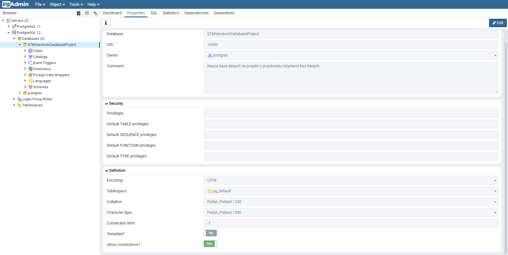

Skrypt do tworzenia czystej bazy danych w pgmyadmin
CREATE DATABASE "STMVendorerDatabaseProject"
    WITH 
    OWNER = postgres
    ENCODING = 'UTF8'
    CONNECTION LIMIT = -1;

COMMENT ON DATABASE "STMVendorerDatabaseProject"
    IS 'Nasza baza danych na projekt z przedmiotu inżynieria baz danych';
